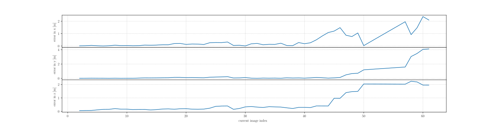
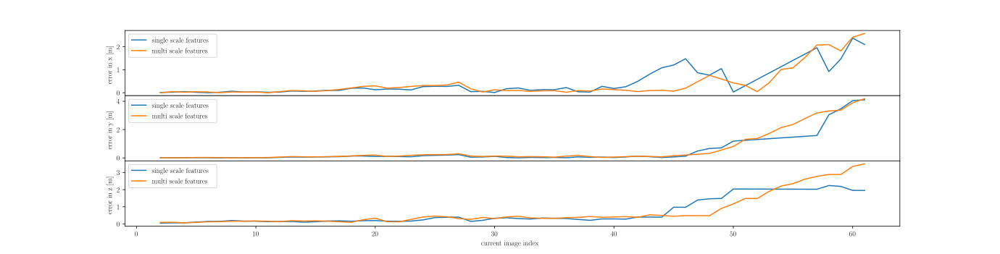

# vikit

This is a collation of few specific implementation for SLAM / VO / VIO. In particular the package implements the following:

- [sparse image alignment](include/vikit/image_alignment.h): Estimates 6-DoF rigid body camera motion using direct image alignment. The method is very efficient since it leverages inverse-compositional Lucas-Kanade for warping the image patches parameterized by 6-DoF rigid body transformation. This results in constant jacobian throughout all the iterations and thereby reducing the computational complexity drastically.
- TODO: semi-dense image alignment
- TODO: dense image alignment

## Analysis
1. Estimated translation error in sparse image alignment approach as a function of current image index.

  

2. Same results as above except here we compare the results against features extracted from multiple scales.

  

